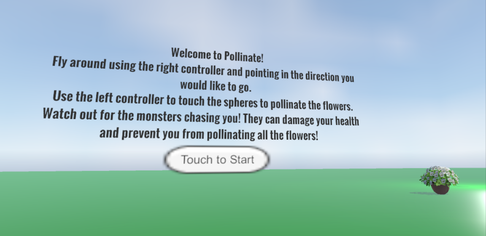

# game
A game developed as a learning project for unity

It is a VR environment where the user is in a world filled with flower pots and a couple of monsters that chase after them. They fly 
around and have to "pollinate" all the flowers before the monsters get them and destroy all of their health.

